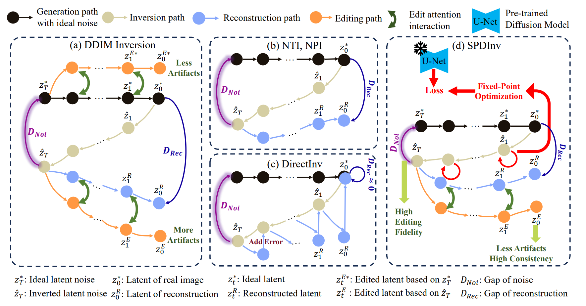
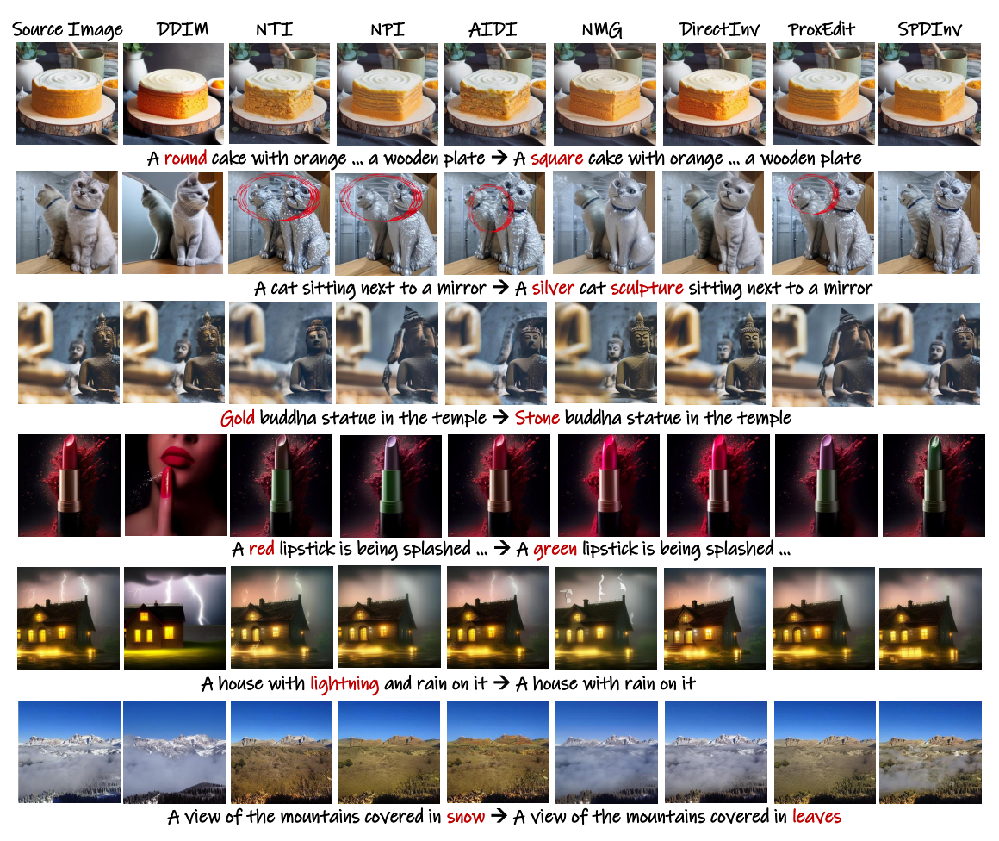
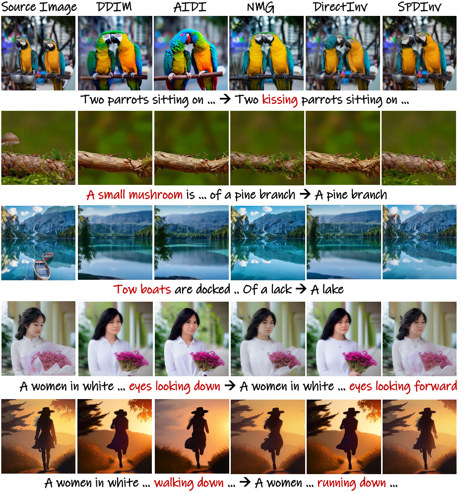
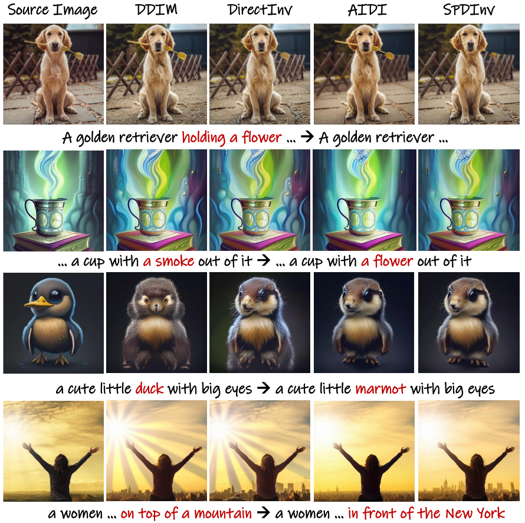
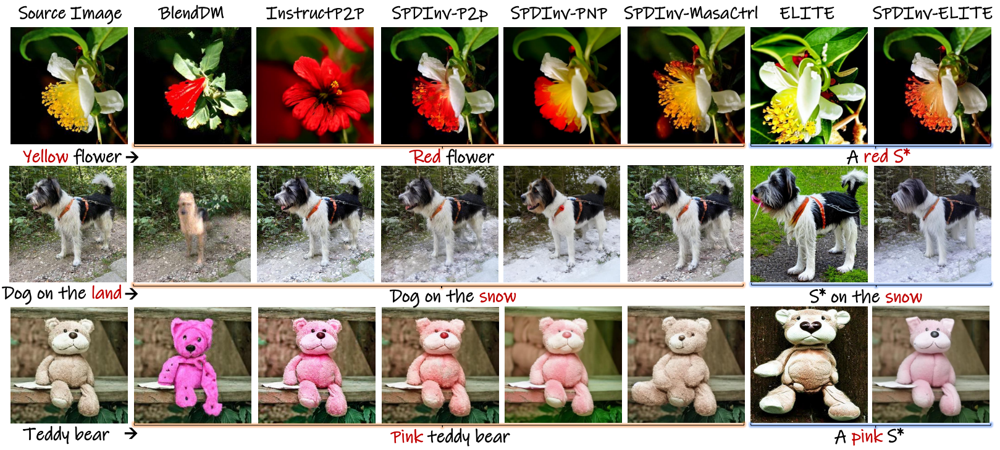

# SPDInv
SPDInv: Source Prompt Disentangled Inversion for Boosting Image Editability with  Diffusion Models

 &nbsp;&nbsp;

[Ruibin Li](https://github.com/leeruibin)1 | [Ruihuang Li](https://scholar.google.com/citations?user=8CfyOtQAAAAJ&hl=zh-CN)1 |[Song Guo](https://scholar.google.com/citations?user=Ib-sizwAAAAJ&hl=en)2 | [Lei Zhang](https://www4.comp.polyu.edu.hk/~cslzhang/)1*

1The Hong Kong Polytechnic University, 2The Hong Kong University of Science and Technology.

:star: If SeeSR is helpful to your images or projects, please help star this repo. Thanks! :hugs:

# 🔎 Overview framework

Pipelines of different inversion methods in text-driven editing. (a) DDIM inversion inverts a real image to a latent noise code, but the inverted noise code often results in large gap of reconstruction $D_{Rec}$ with higher CFG parameters. (b) NTI optimizes the null-text embedding to narrow the gap of reconstruction $D_{Rec}$, while NPI further optimizes the speed of NTI. (c) DirectInv records the differences between the inversion feature and the reconstruction feature, and merges them back to achieve high-quality reconstruction. (d) Our SPDInv aims to minimize the gap of noise $D_{Noi}$, instead of $D_{Rec}$, which can reduce the impact of source prompt on the editing process and thus reduce the artifacts and inconsistent details encountered by the previous methods.

# ⚙️ Dependencies and Installation
TODO

# 🚀 Quick Inference
TODO

# 📷 Editing cases with P2P, MasaCtrl, PNP, ELITE
## Editing cases with P2P

## Editing cases with MasaCtrl

## Editing cases with PNP

## Editing cases with ELITE

# TODO

